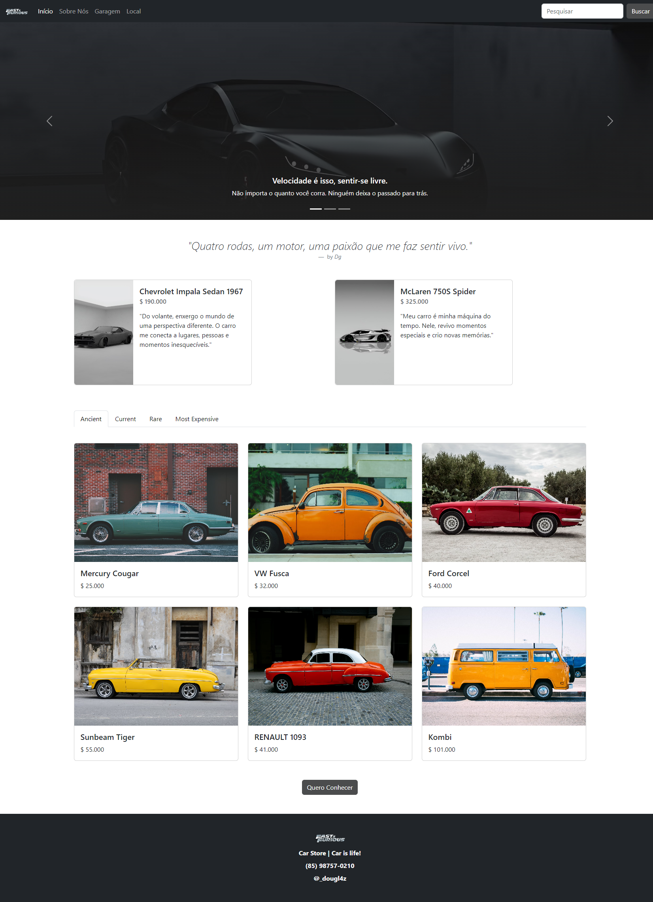

<h1 align="center">
  🚗 Fast and Furious
</h1>

<h4 align="center"><a href="https://fast-furious-dg.vercel.app/">Clique para visitar o projeto</a></h4>

##  Objetivo

- **FAST and FURIOUS é um simple-page que desenvolvi com o objetivo de me aperfeiçoar na Framework do CSS: BOOTSTRAP**

- *Esse site é Responsivo! Composto com catalogos de carros e um simples mapa de localização da consconcessionária*
---
---

## 💼 Tecnologias utilizadas

Para o desenvolvimento deste site utilizei as seguintes tecnologias:

- HTML
- CSS
- Bootstrap;

---

<h2> by</h2>

<table>
  <tr>
    <td align="center">
      <a href="https://github.com/Douglasffjw">
         
        
          <b>Douglas Fernandes</b>
        
      </a>
    </td>
  </tr>
</table>
